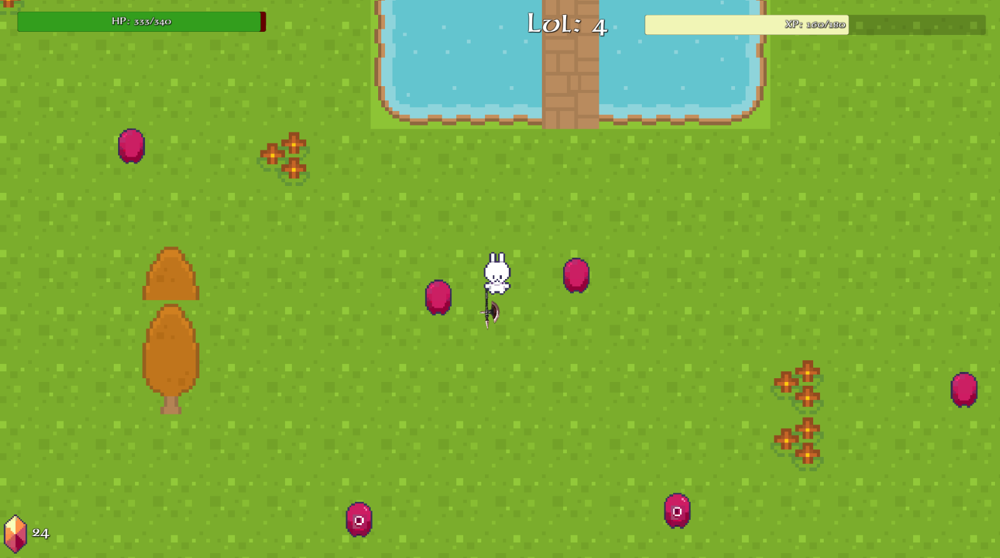

  <h1>Platzi RPG</h1>

 
  

**Table of content**
- [Game Summary](#game-summary)
- [Description](#description)
- [Visual Style](#visual-style)
- [Player Objectives](#player-objectives)

# Game Summary

**Common Information**

**Target Audience:** All ages  
**Genre:** RPG  
**Engine:** Unity  
**Release Platform:** NA  
**Release Store:** NA  

# Description

Creating a 2D Retro RPG using Unity, create a player, levels, experience points, health points, kill enemies, increase your level, improve your stats. Create enemies, quests, scenes, dialogs, audio and more.

This game was made following the course from Platzi:

https://platzi.com/clases/rpg-unity/

# Visual Style
Retro 2D.

# Player Objectives
- Complete the quests
- Kill enemies
- Have fun

